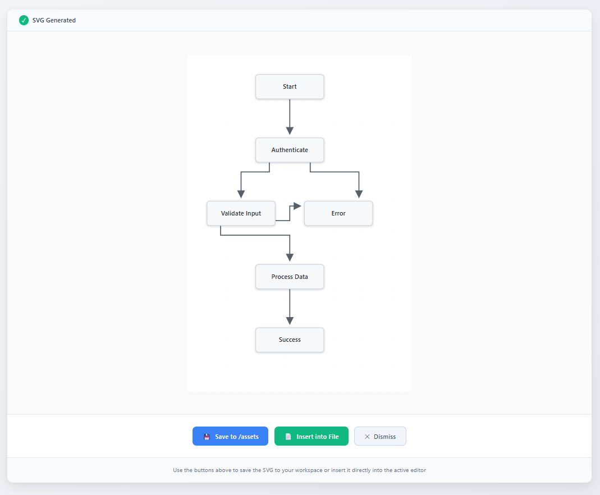
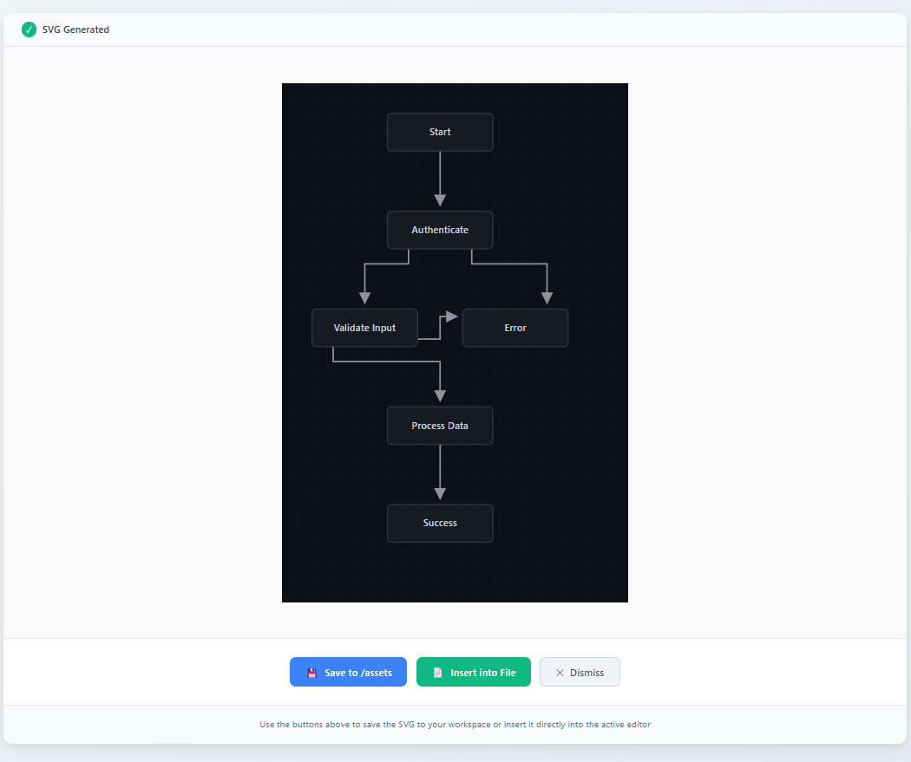

# ArchSVG — Developer-First SVG Architecture Diagrams

Create clean, production-ready SVG flowcharts and architecture diagrams directly inside VS Code.

No bloated UI. No cloud services. No complex syntax.

Just structured diagrams rendered as beautiful standalone SVG.

## Why ArchSVG?

Most diagram tools are either:

- Heavy visual editors with too much friction
- Syntax-heavy (Mermaid-style)
- Or disconnected from real documentation workflows

ArchSVG is built specifically for developers who write documentation.

Generate → Preview → Export → Insert.

## 🎨 Theme Presets

<p align="center">
  <b>GitHub Light</b><br/>
  
</p>

<p align="center">
  <b>GitHub Dark</b><br/>
  
</p>

## ✨ Features

### 🧠 Professional Flowchart Engine

- Multiple layout modes (Vertical, Horizontal, Compact, Symmetric)
- Smart orthogonal edge routing
- Balanced node spacing
- Deterministic layout engine
- Clean arrow rendering

### 🎨 Professional Theme Presets

- GitHub Light
- GitHub Dark
- Minimal Mono
- Blueprint

All themes are optimized for documentation and READMEs.

### 📦 Export Controls

- Configurable canvas padding
- Width presets (600 / 800 / 1200 / 1600 / Auto)
- Background toggle
- SVG minification option

### 💬 Comment-to-Flowchart

Generate diagrams directly from comment arrow notation:

```
// @flowchart
// User -> API
// API -> Database
// API -> Cache
// Database -> Cache
```

Select → Run command → Done.

Supports: line, hash, and block comments.

### 🎨 SVG Icon Generator

- Keyword-based icon generation
- Smart fallback for unknown keywords
- Configurable primary & secondary colors
- Fully sanitized output

### 🔒 Secure & Local

- Client-side only
- No backend
- No external APIs
- No data leaves your machine
- SVG output sanitized for security

### 🚀 Commands

Access via Command Palette (Ctrl+Shift+P / Cmd+Shift+P):

- ArchSVG: Generate SVG Icon
- ArchSVG: Generate Flowchart from JSON
- ArchSVG: Generate Flowchart from Selected Comment
- ArchSVG: Preview SVG
- ArchSVG: Insert SVG into Active File
- ArchSVG: Save SVG to /assets Folder

### ⚙ Extension Settings

Configure in settings.json:
- Customize colors, layout mode, theme, export width, background, and minification via settings.json.

#### Available Settings

- archsvg.primaryColor
- archsvg.secondaryColor
- archsvg.layoutMode
- archsvg.theme
- archsvg.typography
- archsvg.exportWidth
- archsvg.includeBackground
- archsvg.minifyOutput

### 🎯 Built For

- Developers writing documentation
- OSS maintainers
- System architects
- Technical bloggers
- Engineering teams

If you need clean architecture diagrams inside your workflow, ArchSVG is built for you.
